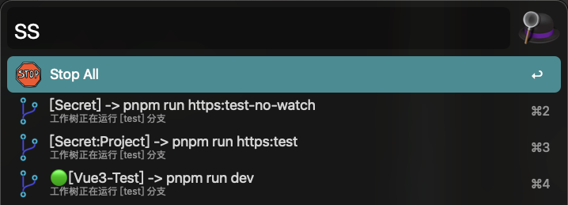

# 背景

**git worktree**是git的高级功能，实际开发时如果需要不断切换分支，比起不断 `stash` 代码，更好的是为不同分支迁出不同工作树（worktree），不同分支（工作树）之间服务切换是个麻烦的问题，通过编写工作流可以自动化这个行为，同时也可以管理不同项目的服务状态。

# 功能

1. 此工作流用于快速管理多个前端项目服务，我自己每天工作都在使用它管理多个**git工作树**，减少重复劳动
2. 支持多个**不同端口**的不同项目同时管理
3. 支持**git工作树**之间服务切换
4. 支持一键关闭**全部服务**，或者选择关闭**单个服务**
5. 同端口项目之间服务互斥
6. 可配置化

# 示例

1. `ss` 管理开发服务

   

2. `sc` 打开配置文件

   

# 使用

1. 下载仓库，双击安装**worktree.alfredworkflow**
2. 通过**Alfred**搜索框输入关键字**ss**调用，首次使用会在 `~/alfred-worktree/worktree.config.js` 中初始化配置
3. 选择**Stop All**会暂停全部前端服务，选择一个服务会停止其他**端口互斥**的服务并**重启**选择的服务
4. 按住 `Ctrl` 选择服务只关闭不重启
5. 以下为目前全部支持字段：

   ```js
   export default {
     projects: [
       {
         name: "Monorepo Project Sub-Package1", // 假设这是一个monorepo项目的一个子包
         root: "/a/b/c", // 配置项目 git 根路径
         cmd: "pnpm run https:test", // 根据你的需要改成启动你的项目的命令
         port: "443", // 你的项目启动端口号
         cmdPath(worktreeRoot) {
           // 参数为git工作树根路径, 无工作树则项目根路径(默认主工作树)
           // 如果是monorepo项目可能会进入子包执行具体子包的命令，需要返回子包package.json路径
           // 非monorepo不需要配置 cmdPath 字段或者直接返回 worktreeRoot
           return `${worktreeRoot}/packages/sub1`;
         },
       },
       {
         name: "Monorepo Project Sub-Package2", // 和上一条配置同属一个git，但是不同子包
         root: "/a/b/c",
         cmd: "pnpm run https:test",
         port: "443",
         cmdPath(worktreeRoot) {
           return `${worktreeRoot}/packages/sub2`;
         },
       },
       {
         name: "Project2", // 非monorepo项目
         root: "/x/y/z",
         cmd: "pnpm run dev",
         port: "5173",
       },
     ],
     style: {
       titleFormatter(project, workspace) {
         const { isRunning } = workspace;
         return `${isRunning ? `🟢` : ""}[${project.name}] -> ${project.cmd}`;
       },
       subTitleFormatter(project, workspace) {
         const { branch } = workspace;
         return `工作树正在运行 [${branch}] 分支`;
       },
     },
   };
   ```

6. Project和Worktree类型：

   ```ts
   export interface Project {
     name: string;
     root: string;
     cmd: string;
     port: string;
     cmdPath?: (rootPath: string) => string;
   }

   export type Worktree = {
     root: string;
     HEAD: string;
     branch: string;
     isRunning: boolean;
   };
   ```

# 注意

1. 对于**Monorepo**项目，如果子包和根路径**共享**构建工具npm依赖，目前只适配了**Vite**项目，**非Monorepo**无所谓
2. 电脑Node版本支持原生**ESM**语法（拥抱未来趋势）

# Todo

1. - [ ] 增加日志输出
2. - [x] 修改配置方式
3. - [x] 支持不同项目同时运行服务
